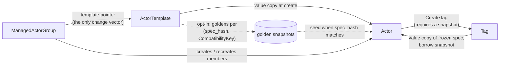

# Actors, Templates, and Managed Actor Groups

Status: proposal (Proposal A: the object model). It absorbs and supersedes
the earlier self-contained Actor proposal. Compatibility and upgrade
mechanics are Proposal B; the interface between the two is pinned in the
shared contracts doc.

Related:

* `multi-arch-golden-snapshots.md` — Proposal B: platform/CompatibilityKey model, golden
  matrix, worker platform reporting, scheduling eligibility.
* `sandboxconfig-lifecycle.md` — companion to B: the SandboxConfigVersion
  lifecycle the upgrades in §6 run on.
* `README.md` — shared contracts both proposals implement
  against (compat key, fidelity ladder, snapshot record schema).

## 1. Motivation

Problems with the model today:

* Every shape that can run in Substrate must first be defined in an
  ActorTemplate. Creating one actor for one user-submitted image requires a
  template lifecycle around it (the flow in #553 is the motivating pain).
* Deleting an ActorTemplate breaks every Actor and Tag that references it:
  actors can no longer suspend or resume, tags can no longer seed new actors.
* There is no way to change the spec of just one actor, and no way to vary
  the startup command per instance. Specs live only in shared templates.
* There is no fleet primitive: nothing enforces that a set of actors stays
  uniform, and nothing can roll them to a new shape.
* Anyone who can create actors can run any OCI image with any config; there
  is no shape-level authorization boundary.

Goals:

* One-off actor creation from an inline spec, without a template.
* Templates that are optional, safe to delete, and decoupled from the actors
  they create.
* A fleet primitive (managed actor group) with enforced uniformity and
  platform-driven rolling upgrades.
* Shape-level RBAC: launching approved shapes, restoring snapshots, and
  running arbitrary specs are three different privileges.
* Runtime (SandboxConfig) upgrades that never silently break or discard user
  state, with a defined migration story for both standalone and grouped
  actors.

Non-goals:

* Cross-architecture migration of a memory lineage (impossible; a lineage
  fixes arch and runtime at seed time — see Proposal B).
* Live spec updates of a running sandbox; spec changes take effect at the
  next boot.
* Per-member state in groups (v1 keeps members fully uniform; see §5).

## 2. Object model overview

| Substrate | GCE | ECS | Kubernetes | Role |
|---|---|---|---|---|
| Actor | instance | task | Pod | the running (or suspended) unit |
| ActorTemplate | instance template | task definition | PodTemplate | creation-time shape, decoupled after create |
| ManagedActorGroup | MIG | service | Deployment/RS | fleet: uniformity + rolling upgrades |
| Tag | machine image (with memory) | — | — | user-owned snapshot artifact |
| SandboxConfig | — | — | RuntimeClass | runtime contract, part of the spec |

Artifact tiers, and the rule that splits them:

* Golden snapshots are platform-regenerable (re-run boot from a spec), so the
  platform fans them out per hardware type and rebuilds them on demand. They
  are disposable caches; losing one costs nothing.
* Tags contain user state the platform cannot re-create. They are never
  fanned out; each records where it was taken and scheduling is best-effort
  toward compatible hardware (Proposal B).



Every solid edge is a value copy or a creation act; no object holds a live
reference into another's spec. The dotted edges are content-addressed: golden
reuse matches on `spec_hash`, not on object identity, which is what lets
templates stay decoupled (§4).

## 3. Creating an Actor (the instance API)

An Actor is self-contained: its spec is materialized by value at creation,
and suspend/resume read only the Actor object (one fewer read than today).

Creation sources are a union; exactly one must be set in the request:

* `spec` — an inline ActorSpec. The actor cold boots from it.
* `source_template` — the server copies the template's spec by value. No
  reference survives; deleting the template later is a no-op for the actor.
* `source_tag` — the server copies the tag's frozen spec by value and borrows
  its snapshot as `status.external_snapshot` (as today).

```proto
message Actor {
  ResourceMetadata metadata = 1;

  // Per-actor placement constraint, ANDed with the spec's worker_selector.
  // +k8s:optional
  Selector worker_selector = 5;

  // Inline spec. On create: union member. After create: always populated —
  // the server materializes the value copy from whichever source was used.
  // +k8s:optional
  // +k8s:unionMember
  ActorSpec spec = 8;

  // +k8s:optional
  // +k8s:unionMember
  ObjectRef source_template = 9;

  // +k8s:optional
  // +k8s:unionMember
  ObjectRef source_tag = 6;

  // Launch-time parameter overrides, valid only with source_template or
  // source_tag. See below for the allowed surface.
  // +k8s:optional
  repeated ContainerOverride overrides = 10;

  // +k8s:optional
  ActorStatus status = 7;
}
```

The ActorTemplate message of today is renamed ActorSpec and exists inline in
Actors, Tags, and ActorTemplates:

```proto
message ActorSpec {
  reserved 1;  // was ResourceMetadata — no longer a resource by itself.

  // +k8s:optional
  Selector worker_selector = 2;

  // +k8s:required # at least one container
  repeated Container containers = 3;

  // +k8s:optional
  repeated Volume volumes = 4;

  reserved 5;  // was SnapshotsConfig — snapshot scope is now per call.

  // +k8s:required
  SandboxConfig sandbox_config = 6;

  // +k8s:optional
  Resources resources = 7;

  reserved 8;  // was ActorTemplateStatus — status lives on resources only.
}
```

### spec_hash

* Every snapshot commit freezes the canonical hash of the spec the captured
  state was built under (`ExternalSnapshot.spec_hash`; canonicalization is
  defined in `README.md`).
* Restoring a snapshot in full requires `spec_hash` to equal the current
  spec's hash. Any mismatch forces a data-only restore (memory dropped,
  filesystem kept, process cold-booted).
* The same hash is half of the golden key `(spec_hash, CompatibilityKey)`, so
  golden eligibility is a content check, not a reference check.

### Launch-time overrides

* Allowed per container: `command`, `args`, `env`, `resources`. Nothing else;
  in particular never `image` and never `sandbox_config`. Shape fields are
  template-locked.
* Precedent: ECS `ContainerOverride`, whose full field list is command, cpu,
  environment(+files), memory(+reservation), resourceRequirements — and no
  image. Image is identity; command and env are parameters.
* Overrides are applied to the value copy before hashing, so an overridden
  actor's `spec_hash` differs from the template's. It therefore forfeits
  golden seeding and cold boots. That is semantically forced anyway — a
  golden is a booted memory image with command and env already baked in —
  so overrides trade away startup acceleration, never correctness.

```proto
message ContainerOverride {
  // +k8s:required
  string name = 1;
  // +k8s:optional
  repeated string command = 2;
  // +k8s:optional
  repeated string args = 3;
  // +k8s:optional
  repeated EnvVar env = 4;
  // +k8s:optional
  Resources resources = 5;
}
```

### Post-creation mutability

* Members of a managed actor group: spec updates are rejected outright (§5).
* Standalone actors: `UpdateActor` on the spec requires the inline-spec
  privilege (§4) — otherwise from-template-only RBAC would be bypassed by
  create-then-edit. Whether a narrower parameter-surface edit should be
  allowed below that privilege is an open question (§9).
* Any accepted spec edit changes the hash; the next resume detects
  `spec_hash != current` and downgrades per the fidelity ladder.

### Resume and the fidelity ladder

* `ResumeActor` carries a per-call floor:

```proto
enum RestoreFidelity {
  RESTORE_FIDELITY_UNSPECIFIED = 0;
  RESTORE_FIDELITY_MEMORY = 1;  // full restore: memory + data
  RESTORE_FIDELITY_DATA = 2;    // may drop memory; keep filesystem state
  RESTORE_FIDELITY_SPEC = 3;    // may cold boot from the spec alone
}
```

* The server resumes at the highest fidelity currently satisfiable. Downgrade
  triggers are an open registry defined in `README.md`; the
  initial three: `spec_hash` mismatch, no compatible hardware for the memory
  image, retired runtime assets.
* No waiting: if the preferred fidelity is unsatisfiable right now, the
  server downgrades immediately rather than parking the request. A floor of
  MEMORY therefore doubles as fail-fast — the call errors instead of
  degrading, and caller-side retry is the de facto wait.

## 4. Why ActorTemplate must exist (and stays optional)

Templates survive, with changed semantics: a template is a document template.
It describes the shape at creation time; the created actor has nothing to do
with it afterwards. Updating a template affects no existing actor; deleting
one is always safe.

The policy argument is the strong one. "Every shape must first be defined in
a template" is a feature when it is a privilege boundary rather than a
structural requirement:

* Template-creation RBAC is not actor-creation RBAC. An admin can let users
  create actors freely while restricting which shapes exist.
* Without that boundary, anyone who can `CreateActor` can run any OCI image
  with any config — the Kubernetes situation, where inline pod specs forced
  the ecosystem to bolt admission controllers on after the fact.
* ECS is the positive precedent: task definitions pin the image; RunTask can
  override only parameters. Substrate builds the same boundary into the API.

The privilege ladder, three tiers, each strictly stronger:

1. create-from-template on template X: fresh boots of admin-approved shapes.
2. create-from-tag on tag Y: additionally restores memory/data state — this
   is data access to whatever the tag captured.
3. inline-spec: arbitrary images and configs; effectively "run anything".
   Also required for post-creation spec edits (§3).

Enforcement hooks into the OpenFGA authorization layer landed in #1670:
`instantiate` as a relation on templates, `restore` on tags, inline-spec as
an atespace- or cluster-level capability.

### Opt-in golden snapshots

* A template may opt in to golden snapshots. The reconciler then maintains
  one golden per `(spec_hash, CompatibilityKey)` pair — one per hardware type the
  fleet exposes, built by running a golden actor on that hardware (mechanics
  in Proposal B).
* Keying by `spec_hash` rather than template UID is what reconciles
  decoupling with reuse: an actor created from the template seeds from a
  golden iff its materialized spec still hashes the same. Edit the template
  and new CompatibilityKeys appear under the new hash; actors from the old shape keep
  matching the old goldens until they drain.
* Goldens are caches. They are never load-bearing for correctness, and the
  platform may rebuild or discard them at will.

### Tags require a snapshot

* A Tag can only be created from a suspended actor that has an external
  snapshot; the tag copies it and freezes the actor's spec alongside
  (`TagStatus.actor_spec`, `hash(actor_spec) == snapshot.spec_hash`).
* Spec-only sharing goes through templates. This keeps exactly one object per
  job — template: shape, tag: state — and makes the tier-2/tier-1 permission
  split coherent: tag access is snapshot access, template access is not.
* Tags are not fanned out across hardware (user state is irreproducible).
  Each tag records the CompatibilityKey it was taken under (field shape owned by
  the contracts doc); the scheduler prefers matching hardware best-effort and
  the fidelity ladder governs what happens when none matches. No waiting.

## 5. Why managed groups live outside ActorTemplate

A template says what to boot; a group says how many, how uniform, and how
they are upgraded. Keeping them separate means one template can serve any mix
of standalone actors and groups, and group mechanics never complicate the
template object.

```proto
message ManagedActorGroup {
  ResourceMetadata metadata = 1;
  ManagedActorGroupSpec spec = 2;
  ManagedActorGroupStatus status = 3;
}

message ManagedActorGroupSpec {
  // The template members are created from. Bumping this pointer is the only
  // way to change members, and starts a rolling recreate.
  // +k8s:required
  ObjectRef template = 1;

  // +k8s:required
  int32 replicas = 2;

  // Rolling recreate knobs (surge / unavailability / health gates): TBD.
  // +k8s:optional
  UpdatePolicy update_policy = 3;
}
```

Uniformity contract:

* `UpdateActor` spec changes on a member are rejected outright. This is the
  ECS semantic — no UpdateTask API exists; task definition revisions are
  immutable and change means replacement — chosen deliberately over GCP's
  MIG model, which allows out-of-band VM modification and then warns that
  the group "might automatically attempt to recreate or revert that VM"
  with "unexpected results". Substrate owns both APIs and has no legacy
  instances API to accommodate, so drift is rejected at the door instead of
  reconciled later.
* The only change vector is `spec.template`: point the group at a new (or
  edited) template and the group rolls — recreate members from the new spec,
  respecting the update policy. A recreate is a cold boot; group membership
  is the declaration that member state is disposable.
* Members are owned by the group controller. Creating or deleting a member
  out-of-band is denied; scaling goes through `replicas`.

RBAC composition:

* A group is created from a template, so tier 1 of the ladder is the natural
  floor for group operators; a group cannot be used to smuggle in an
  arbitrary shape.
* Out of scope for v1, recorded for later: sanctioned per-member state along
  the GCP stateful-MIG boundary — identity and data fields (name, volumes,
  metadata), never boot shape (image, sandbox_config).

## 6. SandboxConfig upgrades

Shared mechanics — new SandboxConfigVersion opens new CompatibilityKeys, goldens are rebuilt per
CompatibilityKey, a memory lineage pins its runtime at seed time, a FULL snapshot
re-roots a lineage off its golden but not off its runtime, and only a cold
boot migrates — are specified in `multi-arch-golden-snapshots.md`, on the
SandboxConfigVersion lifecycle of `sandboxconfig-lifecycle.md`. This
section states only what the object model promises.

### 6.1 Golden actors across hardware types

Owned by Proposal B. What A relies on:

* The golden key is `(spec_hash, CompatibilityKey)`; A supplies the first half,
  B the second (see `README.md`).
* Golden builds are asynchronous and never block actor creation; the
  fallback is a cold boot on the current SandboxConfigVersion.

### 6.2 Standalone actors

* Phase 1 only: new lineages land on new CompatibilityKeys; existing lineages drain by
  natural attrition (crashes, user restarts).
* The platform never force-migrates a standalone actor: it may surface
  staleness in status and, once assets are retired, the fidelity ladder may
  downgrade a resume — but it never discards user memory on its own.
* Rollback: pin the SandboxConfigVersion in the actor's spec (inline-spec tier) or
  recreate from a template pinned to the old SandboxConfigVersion.
* Old goldens and assets are refcounted by dependent lineages; the retention
  floor is the rollback window.

### 6.3 Actors in a managed group

* Group membership is the phase-2 consent Lambda gets for free from
  statelessness: members are recreatable by contract, so platform-driven
  migration is in-contract here and only here.
* A config upgrade reduces to the same rolling recreate as a template bump —
  there is one upgrade mechanism, not two.
* The deadline lever for retiring a vulnerable runtime from the fleet lives
  on groups. Standalone actors get nudges; group members get rolled.
* Whether a wave waits for the new CompatibilityKeys' goldens or accepts cold boots is
  an update-policy knob (§9).

## 7. Scheduling summary

Owned by Proposal B; listed here only to place the seams:

* Worker platform reporting (measured on the node, reported over the
  capacity channel) and the eligibility predicate — class, arch, feature
  superset, lineage pinning — are B's.
* A contributes constraint composition: the actor's `worker_selector` ANDed
  with the spec's, and group-membership constraints.
* A contributes the fidelity decision point: when B's predicate finds no
  worker compatible with a memory image, the resume consults
  `minimum_fidelity` and downgrades immediately (no waiting).

## 8. Dependencies on shared contracts

Defined in `README.md`, implemented by both proposals:

* The compatibility key tuple `(spec_hash, CompatibilityKey)`: canonicalization of
  `spec_hash` (A), shape and fields of `CompatibilityKey` (B).
* The fidelity ladder (`RestoreFidelity`) and the open trigger registry.
* The snapshot record schema: `spec_hash` (A) plus CompatibilityKey and resolved
  runtime assets (B) on the same record.

## 9. Open questions

* Whether a parameter-surface `UpdateActor` (command/env only) should be
  allowed below the inline-spec tier for standalone actors, or whether
  post-creation edits stay tier-3 only.
* Group rolling-update knobs: surge/unavailability analogues, health gates,
  and whether a wave gates on golden readiness for the new CompatibilityKeys.
* Whether groups track a template by name (rolling automatically when the
  template is edited) or by frozen content (explicit pointer bumps only).
* Golden build cost under spec_hash churn: every template edit opens a fresh
  golden matrix; batching, TTLs, or build quotas may be needed.
* Migration of existing ActorTemplate-referencing Actors and Tags to the
  self-contained model.
