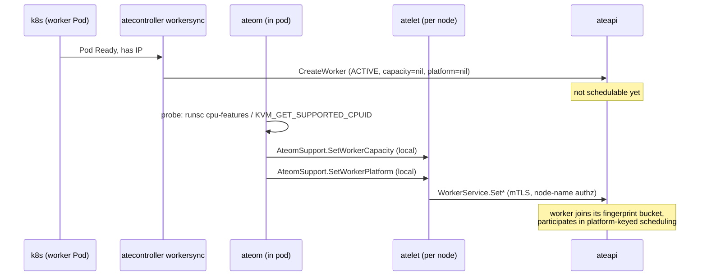
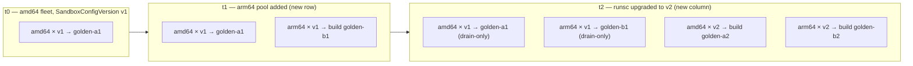
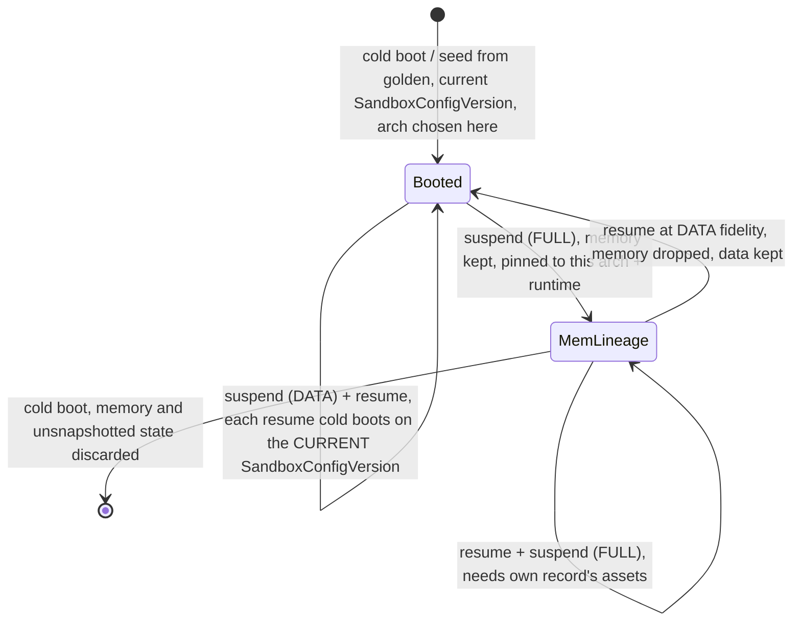
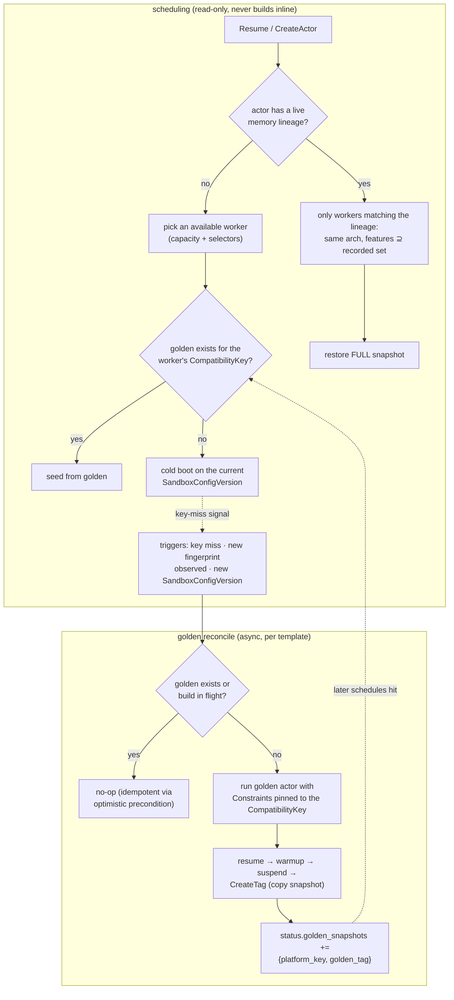

# Multi-Arch and Heterogeneous Hardware Support for Golden Snapshots

Status: Proposal B of a two-proposal split, not yet implemented.

* Proposal A — the instance / template / group object model:
  `actor-instance-model.md`.
* Companion — `sandboxconfig-lifecycle.md`: the SandboxConfigVersion object
  model behind `sandbox_config_digest` (immutable versions, cluster
  defaults, disable and retention levers).
* Shared contracts between the two proposals: `README.md`.
* B stands alone under today's template model: the golden key degenerates to
  `(template UID, CompatibilityKey)` until A replaces the first half with
  `spec_hash` per the contracts doc. The lower layers — worker platform
  reporting, CompatibilityKey recording, restore-side validation — fix bugs that
  exist today (#1657; the snapshot manifest records assets without their
  architecture) and should not wait for A.
* Golden+data resume is removed: a DATA snapshot no longer combines with a
  golden (`DATA_ON_GOLDEN` goes away). A DATA snapshot resumes by cold boot
  on the current SandboxConfigVersion, with its data. Memory compatibility therefore
  concerns only goldens and FULL snapshots throughout this doc.

## Problem

A golden snapshot is currently keyed by template UID alone
(`Tag.status.actor_template_uid`), and is assumed restorable on any ACTIVE
worker of the same sandbox class. That assumption breaks as soon as the fleet
is heterogeneous:

* A gVisor checkpoint records the CPU feature set of the worker that took it;
  restore on a worker missing one feature fails (`incompatible FeatureSet`,
  #1657). One WorkerPool must therefore be one CPU model today.
* The snapshot `manifest.json` flattens sandbox assets to the snapshot-taking
  node's architecture but does not record which one, so a mixed amd64/arm64
  fleet restores wrong-arch binaries with no guard.
* Updating a SandboxConfig never invalidates or regenerates goldens; golden
  restores keep the old sandbox binaries forever while cold boots use new ones.

Once multiple architectures and sandbox config versions exist, one template
needs multiple golden snapshots, and scheduling must know which workers can
restore which snapshot.

## Industry background

* AWS Lambda SnapStart: snapshots bind to immutable published function
  versions; the platform re-runs init and re-snapshots automatically when it
  rotates runtime patches. Runtime versions have per-arch immutable ARNs and
  per-function update modes (Auto / Function update / Manual pin).
* Modal: memory snapshots are specific to the worker type (CPU flags) that
  created them; one function accumulates ~6 snapshots lazily during its first
  cold starts. Snapshot lifecycle is platform-managed, never user-managed.
* Firecracker: snapshots are portable only if guest-visible CPU features are
  invariant; CPU templates mask CPUID at bake time. Restore succeeds even on
  incompatible hosts and the guest crashes later (SIGILL).
* GKE Pod Snapshots (gVisor): restore validates spec hash, identical machine
  series + architecture, and matching gVisor kernel / GPU driver versions. E2
  is unsupported because its machine type does not pin a CPU model.
* gVisor: checkpoint records the (possibly levelled) feature set; restore is a
  subset test against the live host. `dev.gvisor.internal.cpufeatures` levels
  the guest CPUID at boot (amd64 only). runsc build version must match exactly.

Two composable strategies emerge:

* Normalize: level the guest-visible CPU at boot so one snapshot serves every
  worker whose CPU is a superset of the baseline.
* Multiply: keep one snapshot per distinct hardware/runtime combination,
  created lazily.

The user-facing reference stays a single logical object; the platform resolves
it per platform, like an OCI image index resolves a tag per `(os, arch)`.

## Compatibility model

Snapshot compatibility is captured by a CompatibilityKey; a memory artifact
restores exactly on the workers matching its key:

```protobuf
message CompatibilityKey {
  string architecture = 1;           // GOARCH: "amd64", "arm64"
  SandboxClass sandbox_class = 2;
  // Content digest of the SandboxConfig generation the snapshot was taken
  // under. Covers per-arch assets, pause image, and the CPU feature baseline.
  // With immutable SandboxConfigVersions, this digest is the version's identity.
  string sandbox_config_digest = 3;
  // Set only when the config declares no CPU feature baseline (or the runtime
  // cannot enforce one): the snapshot is then pinned to one machine model.
  string platform_fingerprint = 4;
}
```

* With a baseline the CompatibilityKey is `(arch, class, config_digest)`: the fingerprint
  dimension is absorbed by levelling.
* Without a baseline the CompatibilityKey degrades to per-fingerprint, one golden per
  machine model (the Modal shape). Correct, just a larger matrix.
* The version digest, not the SandboxConfig name, is the compatibility
  boundary: names are stable pointers, contents drift. A new
  SandboxConfigVersion means new CompatibilityKeys, with no separate invalidation
  mechanism.
* Only memory artifacts carry a CompatibilityKey: goldens and FULL snapshots (including
  FULL-scope Tags). A DATA snapshot carries filesystem/data state only,
  resumes by cold boot on the current SandboxConfigVersion, and carries no CompatibilityKey — the platform
  treats data as hardware-neutral (arch-specific artifacts a workload writes
  into its own filesystem are the workload's concern).

Runtime support for baselines:

| Runtime               | Levelling mechanism                  | Without it        |
|-----------------------|--------------------------------------|-------------------|
| gVisor amd64          | `dev.gvisor.internal.cpufeatures`    | per-fingerprint   |
| gVisor arm64          | none (`Intersect` unsupported, #1657)| per-fingerprint   |
| microVM / Firecracker | CPU templates (bake time only)       | per-fingerprint   |
| microVM / CHV         | none (no CPUID masking upstream)     | per-fingerprint   |

Validation must reject a baseline for combinations that cannot enforce it;
silently ignoring one would fake a smaller matrix and reintroduce the #1657
failure mode.

## API design

### SandboxConfig

The config is the only object that defines what "compatible" means. It is a
workload-side runtime contract (RuntimeClass analogue), not a worker property:
atelet fetches sandbox binaries per actor from manifest-pinned URLs, so any
worker can serve any config version. Coupling it into WorkerPool would bind
capacity to runtime versions, defeat multiplexing, and turn every runtime
upgrade into a pool rollover.

Addition to the CRD spec, keyed by GOARCH like `assets` already is:

```yaml
spec:
  assets:
    amd64: { ... }
    arm64: { ... }
  # Optional. Feature names use the runsc cpu-features / Linux flag
  # dictionary. Rejected for runtimes that cannot enforce levelling.
  cpuFeatureBaselines:
    amd64: [fpu, vme, de, pse, tsc, msr, ...]
```

One declared baseline plays three roles:

* Admission predicate: a worker may serve the config iff its measured features
  are a superset of the baseline.
* Boot mask: the guest sees `host ∩ baseline`. Because scheduling only admits
  superset workers, this always equals the baseline — the declared value is an
  invariant, not an upper bound, which closes the validation gap gVisor leaves
  open (#1657).
* Key component: the baseline is part of the SandboxConfigVersion digest,
  so changing it creates new CompatibilityKeys and triggers re-goldening.

Evolution semantics follow Lambda's runtime management model:

* Default: templates track the SandboxConfig's latest version; new versions
  roll out via new CompatibilityKeys while old goldens keep serving existing snapshots.
* Deploy-gated: a template re-resolves the SandboxConfigVersion only when
  the template itself is updated.
* Pinned: a template pins a specific SandboxConfigVersion; the owner
  assumes responsibility for security updates. Intended for rollback, not for permanent use.

A cluster default SandboxConfig per sandbox class keeps the common path at two
user-facing objects (WorkerPool + ActorTemplate); only users who pin versions
or tune baselines touch SandboxConfig directly.

### Worker

Workers report measured facts; the control plane derives what they can serve.
Machine-type or pool labels are proxies (E2 machine types map to several CPU
models and support no `min-cpu-platform`); measurement is the invariant.

```protobuf
message Worker {
  // ... existing fields ...
  WorkerPlatform platform = 10;
}

message WorkerPlatform {
  string architecture = 1;
  // Guest-visible CPU feature ceiling for this worker's sandbox class:
  //   GVISOR:  output of `runsc cpu-features`
  //   MICROVM: KVM_GET_SUPPORTED_CPUID, canonicalized to Linux flag names
  repeated string cpu_features = 2;
  // sha256 over (architecture, cpu_features); workers on identical hardware
  // share one, so per-config compatibility is computed once per fingerprint.
  string platform_fingerprint = 3;
  string kernel_version = 4;
  // microVM only: KVM snapshots do not restore across differing TSC rates
  // unless the target supports TSC scaling.
  uint64 tsc_khz = 5;
  bool has_tsc_scaling = 6;
}
```

* The probe runs in ateom (per-class binaries already exist), inside the pod,
  so it measures what the guest will actually see.
* Reporting reuses the capacity channel: ateom → local atelet
  (`AteomSupport`) → ateapi `WorkerService`, with a `SetWorkerPlatform` RPC
  mirroring `SetWorkerCapacity` (same mTLS node-identity authorization, same
  report-at-startup, retry-until-accepted, replace semantics). "Capacity is
  the Worker's to report, not the syncer's to infer" applies verbatim.
* A worker with no reported platform is excluded from platform-keyed
  placement, exactly as a worker with no reported capacity receives no
  actors. No new state machine.

### ActorTemplate

The spec does not enumerate the matrix. CompatibilityKeys are derived from the worker
pools the template can land on; an optional allowlist can restrict them:

```protobuf
message ActorTemplate {
  // ... existing fields ...
  // Optional. Restricts which platforms get goldens, e.g. ["amd64"].
  repeated string platforms = 9;
}

message ActorTemplateStatus {
  repeated GoldenSnapshotStatus golden_snapshots = 1;
}

message GoldenSnapshotStatus {
  CompatibilityKey platform = 1;
  ObjectRef golden_tag = 2;
  google.protobuf.Timestamp take_golden_snapshot_at = 3;
  string error_message = 4;
}
```

Under Proposal A the golden pipeline becomes opt-in per template, and the
key's template half becomes `spec_hash`: the full golden key is the contract
tuple `(spec_hash, CompatibilityKey)` — A owns the first half, this proposal the
second; see `README.md`. Until A lands, the degenerate form
keys on template UID as today.

The CompatibilityKey is recorded in three more places, validated at each hop:

* `Tag.status` (today keyed by template UID only).
* The FULL snapshot's API record, which also carries the resolved runtime
  asset config (planned change: the resolved assets move from the
  storage-side `manifest.json` into the snapshot record). A DATA snapshot
  needs neither a CompatibilityKey nor pinned assets — it cold boots on the
  current SandboxConfigVersion and records only its `spec_hash`.
* Actor status, while the actor holds a FULL snapshot: the CompatibilityKey its memory
  belongs to. The golden is borrowed only transiently at seed time.

## Scheduling

A worker is eligible for an actor iff all of:

1. `sandbox_class` matches (never relaxed; snapshots are not portable across
   classes).
2. `architecture` matches.
3. Worker `cpu_features ⊇` the config's baseline (fingerprint equality when
   the CompatibilityKey is per-fingerprint).
4. If the actor resumes from a FULL memory snapshot (or is being seeded from
   a golden): the worker must match the memory record's architecture and
   offer a feature superset of its recorded set. A memory image must be
   resumed by the exact sandbox build that produced it, so a memory lineage
   keeps its architecture and runtime version for life; only a cold boot ends
   it. A DATA snapshot imposes no hardware constraint: its resume is a cold
   boot on the current SandboxConfigVersion, schedulable like a fresh actor.

Condition 3 is evaluated once per `(fingerprint, config_digest)` pair and
cached; the hot path does equality checks only.

For gVisor the restore-side check fails loudly; for KVM runtimes restore
"succeeds" and the guest hits SIGILL later on the first missing instruction.
For microVM the scheduler-side check is therefore the only guard, not defense
in depth.

## User-created Tags

Golden snapshots and user Tags split on one rule: the platform fans out only
artifacts it can regenerate deterministically. A golden is a boot from a spec,
rebuildable per CompatibilityKey at will. A Tag freezes a user's running state, which the
platform cannot re-run — Modal and Lambda draw the same line by
re-snapshotting only platform-controlled init, never user mid-execution
state. Consequences:

* No multi-hardware fan-out: a Tag is a single artifact, taken on whatever
  hardware the source actor happened to run.
* The Tag records its birth CompatibilityKey at creation, alongside the frozen
  spec Proposal A puts there.
* Only FULL-scope Tags carry memory and face hardware matching at all; a
  DATA-scope Tag always resumes by cold boot, on any eligible worker.
* For FULL Tags, scheduling is best-effort toward the birth platform, using
  the same predicate as memory lineages: architecture equality, worker
  features ⊇ the recorded set.
* No waiting: if no compatible worker exists at resume time, the per-call
  `minimumFidelity` (surface defined in Proposal A and the contracts doc)
  decides immediately:
  * MEMORY — fail fast; the caller's retry loop is the de-facto park;
  * DATA — drop the memory layer, keep filesystem/data state, cold boot the
    processes;
  * SPEC — fresh boot from the frozen spec alone.
* Precedents for the fidelity ladder: GKE Pod Snapshots requires an identical
  machine series for whole-pod scope but relaxes rootfs-only restores across
  machine families (E2 included); E2B's `keepMemory: false` saves a
  filesystem-only snapshot that cold-boots on resume.

## Lifecycles

### Worker registration



### ActorTemplate under multi-arch and multi-runtime assets, step by step

An unpinned template (say `sandbox_config: gvisor:default`) owns a golden
matrix: one row per architecture its admitted pools expose, one column per
SandboxConfigVersion of the referenced SandboxConfig. Both dimensions grow at runtime, and
the machinery treats "an arm64 pool appeared" and "runsc was upgraded" as the
same event: new CompatibilityKeys with demand and no golden. The steps mirror Lambda's
runtime management flow: publish a new runtime version, re-snapshot per arch,
drain the old version.



Step 0 — template creation.

* The template names the SandboxConfig, does not pin a specific
  SandboxConfigVersion.
* With goldens opted in, the reconciler builds a golden for every
  CompatibilityKey it discovers: the worker platforms observed among the
  pools the `worker_selector` admits, under the SandboxConfig's current
  version. Discovery drives the set; `spec.platforms` only narrows it, it
  does not define it.

Step 1 — matrix growth events.

* New column: the referenced SandboxConfig publishes a new
  SandboxConfigVersion (new runsc/CHV assets, changed baseline).
* New row: a worker with a previously unseen architecture reports its
  platform (the autoscaler added a pool the `worker_selector` admits).
* Existing CompatibilityKeys are untouched by either event: restores read the resolved
  assets frozen on snapshot records, never the live SandboxConfig.

Step 2 — golden (re)creation per CompatibilityKey.

* The template reconciler builds one golden per new CompatibilityKey with demand: run a
  golden actor with scheduling constraints pinned to the CompatibilityKey, warm up,
  suspend, tag. Idempotent via the existing optimistic preconditions.
* Eager for CompatibilityKeys implied by pools that exist at template creation; lazy
  (first demand) for rows and columns that appear later.

Step 3 — phase 1: new lineages land under new CompatibilityKeys.

* Placement is worker-first: pick an available worker (capacity and
  selectors), then look up the golden for that worker's CompatibilityKey.
* Golden found → seed from it. No golden (still building, or first demand on
  this key) → cold boot on the current SandboxConfigVersion; the miss is the
  demand signal that starts the build. Nothing ever waits on a golden.
* Once a new column exists, old-column CompatibilityKeys are drain-only: no new lineages
  seed from their goldens. Convergence is one-way.

Step 4 — phase 2: migrating existing actors.

With golden+data resume removed, a memory lineage exists only while an actor
keeps FULL snapshots. That splits the population in two:

* DATA-scope actors self-migrate: every resume is a cold boot on the current
  SandboxConfigVersion, so the next suspend/resume cycle after a new column appears moves
  them there. No lever, no policy, no golden dependency — the golden was
  borrowed once at seed time and never again.
* FULL-scope actors are the only pinned population. A FULL record pins the
  runtime assets it was taken under; every restore reproduces an old-runtime
  memory image. The only exits are a cold boot (memory discarded, data kept
  if the suspend also captured data) or a resume at DATA fidelity (drop the
  memory layer, keep data — the `minimumFidelity` ladder applied by policy).



Migration levers, by intrusiveness:

* nothing, for DATA-scope actors: migration is a side effect of their normal
  resume path;
* natural attrition, for FULL-scope actors: crashes and user-driven restarts
  end memory lineages over time;
* deadline fidelity downgrade (security lever): FULL lineages still on a
  vulnerable runtime past a policy window are resumed at DATA fidelity —
  memory dropped, data kept, strictly less lossy than a bare cold boot, and
  the backstop that actually removes a patched-out runsc from the fleet. Its
  only legitimate forced execution path is a managed group's rolling recreate
  (Proposal A), where membership is consent; standalone actors are only
  nudged (staleness surfaced in status, downgrade once assets retire). If
  this proposal ships alone, phase 2 for FULL holders is natural attrition
  only.

Removing golden+data resume also collapses golden retention: no actor
snapshot references a golden after seeding, so a drain-only golden has no
dependent lineages by construction and can be reaped as soon as the rollback
window closes.

Step 5 — rollback.

* Pin the template to the previous SandboxConfigVersion, or revert the
  default SandboxConfig's content (the version digest then matches the old
  CompatibilityKeys, whose goldens still exist).
* Retention floor: old goldens, snapshot blobs and asset files must outlive
  the rollback window.

Step 6 — observability.

* Actor status and lifecycle events expose the actor's current SandboxConfigVersion,
  architecture, and — while it holds one — the FULL record (with seed
  provenance) its memory came from: "which runsc is this actor on" must be
  one query, per Lambda's `INIT_START` precedent.

### ActorTemplate and scheduling



* Golden creation is minutes of work (warmup, suspend, tag copy); it never
  blocks a resume. A miss is a demand signal to the reconciler, which is the
  existing `ActorTemplateReconciler` generalized from one golden to a set of
  CompatibilityKeys. Its idempotency machinery (golden actor naming, optimistic
  preconditions, `GoldenTagConflict`) carries over.
* Eager/lazy hybrid: CompatibilityKeys implied by existing pools can be built eagerly at
  template creation; CompatibilityKeys for fingerprints that appear later (autoscaler
  introduces a new machine model) build lazily on first demand.
* Worker-first placement makes the CompatibilityKey an output of capacity,
  not an input: an actor seeds under whichever eligible worker had room. The
  key becomes sticky only while the actor holds FULL snapshots; DATA-scope
  actors re-enter placement fresh on every resume.

## For users coming from Kubernetes

* In Substrate, k8s Pods are the machines. WorkerPool ≈ node pool, Worker ≈
  Node (ateom reports capacity and platform like kubelet reports node status,
  except the platform is measured, not declared), ActorTemplate ≈ Deployment,
  Actor ≈ Pod.
* SandboxConfig ≈ RuntimeClass, with the scheduling glue derived instead of
  hand-written: RuntimeClass's `scheduling.nodeSelector` is maintained by the
  operator and silently rots; here the baseline is machine-checked against
  measured worker features.
* Golden snapshots per CompatibilityKey ≈ a multi-arch image index: reference one logical
  name, the system resolves the right per-platform variant.
* The extra strictness relative to k8s exists because scheduling an actor asks
  "can this worker resume a memory image frozen elsewhere", not "can this node
  run this pod". The frozen image contains the guest's belief about its CPU;
  the baseline is the promise that keeps that belief true everywhere.

## Open questions

* CHV has no CPUID masking, so microVM CompatibilityKeys stay per-fingerprint until
  masking lands upstream (or Firecracker is used on amd64). Homogeneous
  microVM pools are the interim answer.
* gVisor arm64 cannot intersect feature sets, so arm64 baselines must be
  rejected until upstream support exists.
* Migration policy for FULL holders: when to apply the deadline fidelity
  downgrade (resume at DATA, memory dropped) to lineages on a retired
  runtime, and how much notice standalone actors get before assets retire.
* Retention: with golden+data resume gone, goldens have no dependent
  snapshots — the floor is just the rollback window; FULL snapshot records
  still refcount their pinned assets (roadmap already lists snapshot
  retention policies).
* Whether the key-miss demand signal should also gate WorkerPool autoscaling
  (avoid provisioning machine models no template has goldens for).
