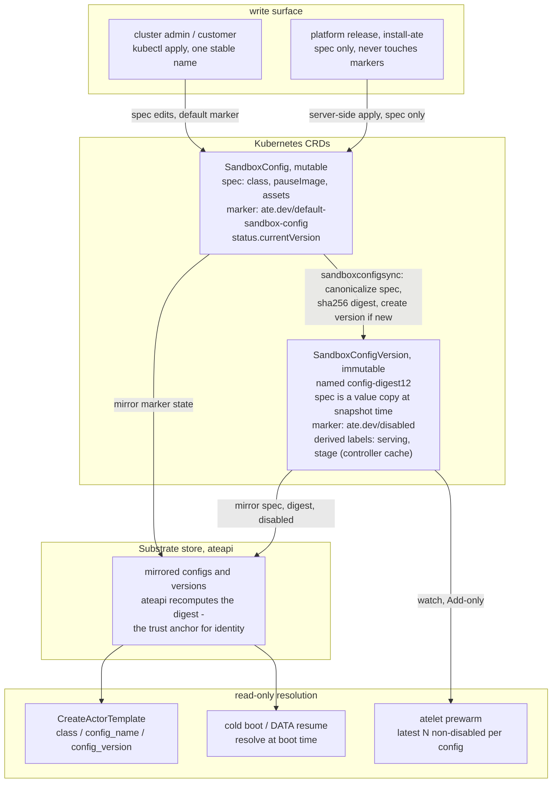
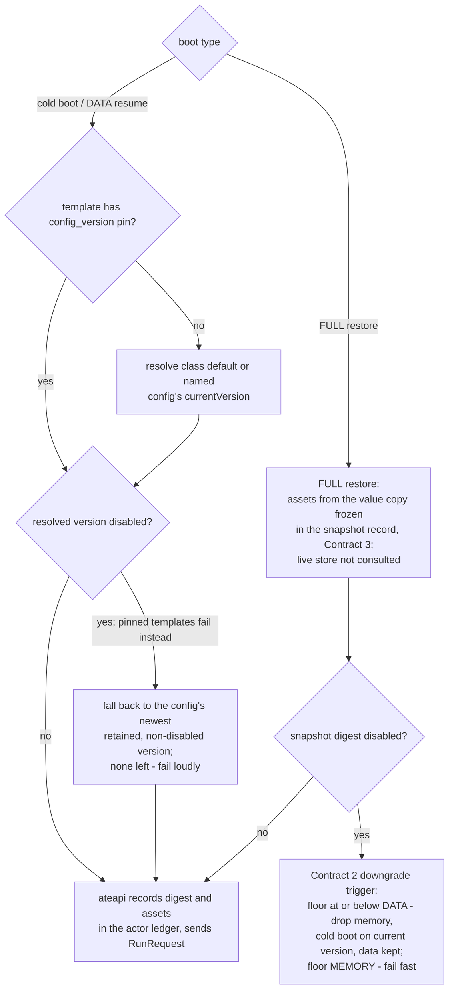
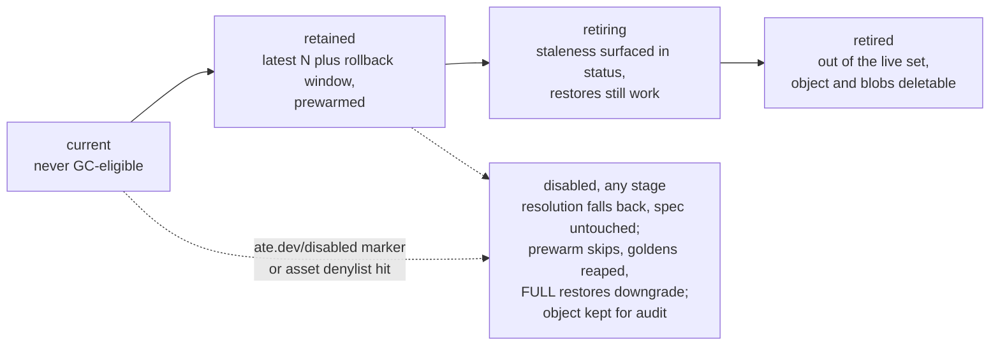

# SandboxConfig Lifecycle: Immutable Versions and Cluster Defaults

Status: proposal, companion to `multi-arch-golden-snapshots.md` (golden
mechanics per CompatibilityKey) and `README.md` (Contract 3:
the snapshot record replaces the storage-side `manifest.json`). Evolution
semantics follow Lambda's runtime management model; see Proposal B's
industry background.

## Summary

* SandboxConfig stays a mutable, user-facing object — the write surface.
  A controller snapshots every content change into an immutable
  `SandboxConfigVersion` (the ControllerRevision pattern), named by content
  digest, and mirrors both into the Substrate store.
* Default selection copies StorageClass's marker idea, adapted for mutable
  parents: a per-class default marker on SandboxConfig objects, most
  recently designated wins. Upgrades update spec only and never touch
  markers, so a customer's default takeover survives platform releases.
* The content digest is computed server-side, once, and is the version's
  identity (`CompatibilityKey.sandbox_config_digest`). Digest naming makes
  content rollback reuse the old version object instead of minting a new
  one.
* ActorTemplates name only a sandbox class (like a Pod's
  `runtimeClassName`) on the common path; naming a SandboxConfig tracks
  that config's current version; pinning a SandboxConfigVersion is the
  exception, for rollback.
* Convergence is one-way: cold boots and DATA resumes always land on the
  resolved current version; only FULL memory lineages stay pinned, and the
  `minimumFidelity` ladder is the lever that migrates them.
* Vulnerable versions are disabled, not deleted: a disable marker on a
  version (or a denylist entry for one asset digest) takes effect on the
  next resolution and turns FULL restores into fidelity downgrades.

## Object model

`SandboxConfig` (cluster-scoped CRD, mutable):

* `spec` — the desired current content: `sandboxClass`, `pauseImage`
  (digest-pinned), per-GOARCH `assets` (url + sha256), later
  `cpuFeatureBaselines` (Proposal B). Admission keeps today's per-class
  completeness checks (`sandboxconfig-validation.yaml`).
* `ate.dev/default-sandbox-config: "true"` — metadata marker: candidate
  default for its class.
* `status`, controller-written: `currentVersion` (name + digest of the
  version matching the current spec), `servingVersion` (what resolution
  actually returns — differs from `currentVersion` only while the disable
  fallback below is active), `observedGeneration`, `defaultSince`
  (timestamp of the last unmarked→marked transition, the tie-breaker
  below), conditions.

`SandboxConfigVersion` (cluster-scoped CRD, controller-generated only —
admission rejects other writers):

* Named `<config-name>-<digest12>`; ownerRef to its SandboxConfig. Spec is
  a value copy of the parent spec at snapshot time, immutable
  (ValidatingAdmissionPolicy). Digest naming is what makes reverting the
  parent's content land back on the existing old object.
* `ate.dev/disabled: "true"` — metadata marker, see Disabling below. The
  only user-written mark on a version.
* Controller-written derived labels, so one version answers "am I live?"
  on sight: `ate.dev/serving: "true"` (resolution for this config
  currently returns it, disable fallback included) and a retention-stage
  label; both surfaced as printer columns (`kubectl get
  sandboxconfigversions` → CLASS, DIGEST, SERVING, DISABLED, STATE, AGE).
  Derived cache in the Knative `routingState` sense — the source of truth
  stays the parent's status, and the labels may lag it by a beat.
* Version objects are projections of the store rows, and self-heal:
  deleting one that is still retained gets it recreated by the sync
  controller (digest naming makes the rebuild byte-identical — stronger
  than ControllerRevision, where only the current revision is
  reconstructible, from the parent spec). Admission restricts delete to
  the controller like it does create, so a version leaves the cluster
  only through the retention flow, and "deleted" always means "left the
  retained set".

Substrate resources (new tables + ateapi service): synced copies of both
objects — configs with their marker state and current-version pointer,
versions with spec value copy, digest, class, disabled flag. Resolution
reads this store; the CRDs are the write surface.

ActorTemplate `sandbox_config` field:

* `sandbox_class` (required) alone — resolve the class default config,
  track its current version. The common path.
* `config_name` — track a specific SandboxConfig's current version
  (customer-owned configs without cluster-wide effect).
* `config_version` — exact pin to one SandboxConfigVersion. Rollback tool,
  Lambda Manual-mode responsibility transfer.

Default resolution rule, used everywhere below: among SandboxConfigs of
the class that are marked default, pick the latest `defaultSince`; follow
its `currentVersion`. If the current version is disabled, fall back to the
config's newest retained, non-disabled version (the rollback target —
warm and golden-bearing by construction); only when none exists does the
config resolve to nothing. No match → cold boots fail with an error
naming this rule; keeping at least one live default per class is the
installer's job, and removing a class's last marker draws a warning — an
explicit no-default state, not an error.

Why a mutable parent instead of flat version objects: every release and
every customer edit would otherwise have to mint a fresh object name
(`default-0-2`, …), which fights `kubectl apply` and GitOps pruning and
pushes name bookkeeping onto humans. With the parent, admins apply one
stable name forever; the accumulating objects are controller-owned, like
ReplicaSets under a Deployment.

The default marker deliberately lives on the config, not on versions.
Rotations are rare, but they are automated — a security patch must be a
zero-human-step rotation for the bounded-patching story to hold — so a
version-level marker would need an owner to advance it on every rotation:
automated, it is just `currentVersion` materialized as annotation churn on
controller-owned objects; manual, it puts a human step inside the patch
path and reintroduces the takeover steal-back the parent model removes.
The three axes stay separate: the marker answers "which config leads the
class" (admin, rare), the spec answers "which content is current"
(release, every upgrade), disable answers "which content is safe"
(security, emergency). Versions still show their situation locally via
the controller-derived `serving`/stage labels above — observability at
the version, authority at the config.

## API sketch

CRD — `pkg/api/v1alpha1/sandboxconfig_types.go`:

```go
const (
	// On SandboxConfig. Candidate default for its class; among marked
	// configs the latest status.defaultSince wins.
	DefaultSandboxConfigAnnotation = "ate.dev/default-sandbox-config"
	// On SandboxConfigVersion. The only user-written mark on a version.
	DisabledAnnotation = "ate.dev/disabled"
	// Controller-derived labels on SandboxConfigVersion: observability
	// cache, authority stays in SandboxConfig status.
	ServingLabel = "ate.dev/serving"
	StageLabel   = "ate.dev/stage" // retained | retiring | retired
)

type SandboxConfig struct {
	metav1.TypeMeta   `json:",inline"`
	metav1.ObjectMeta `json:"metadata,omitempty"`

	// Mutable: the desired current content. Every content change is
	// snapshotted by the sync controller into a SandboxConfigVersion.
	// +required
	Spec SandboxConfigSpec `json:"spec"`

	// +optional
	Status SandboxConfigStatus `json:"status,omitempty"`
}

type SandboxConfigSpec struct {
	// +required
	SandboxClass SandboxClass `json:"sandboxClass"`

	// +required
	PauseImage string `json:"pauseImage"`

	// GOARCH -> asset name -> {url, sha256}.
	// +required
	Assets map[string]map[string]AssetFile `json:"assets"`

	// cpuFeatureBaselines joins here under Proposal B; like every spec
	// field it is covered by the content digest.
}

type SandboxConfigStatus struct {
	// currentVersion is the version whose spec equals this config's
	// canonicalized spec.
	// +optional
	CurrentVersion VersionRef `json:"currentVersion,omitempty"`

	// servingVersion is what resolution actually returns; differs from
	// currentVersion only while the disable fallback is active.
	// +optional
	ServingVersion VersionRef `json:"servingVersion,omitempty"`

	// +optional
	ObservedGeneration int64 `json:"observedGeneration,omitempty"`

	// defaultSince is stamped on the unmarked -> marked transition of the
	// default annotation; the per-class tie-breaker (latest wins).
	// +optional
	DefaultSince *metav1.Time `json:"defaultSince,omitempty"`

	// +optional
	Conditions []metav1.Condition `json:"conditions,omitempty"`
}

type VersionRef struct {
	Name   string `json:"name"`
	Digest string `json:"digest"`
}

// SandboxConfigVersion is controller-generated only (admission rejects
// other writers); spec, digest and revision are immutable
// (ValidatingAdmissionPolicy).
type SandboxConfigVersion struct {
	metav1.TypeMeta   `json:",inline"`
	metav1.ObjectMeta `json:"metadata,omitempty"` // name: <config>-<digest12>

	// Value copy of the parent spec at snapshot time.
	// +required
	Spec SandboxConfigSpec `json:"spec"`

	// sha256 over the canonicalized spec; ateapi recomputes it at sync
	// (the trust anchor). This is CompatibilityKey.sandbox_config_digest.
	// +required
	Digest string `json:"digest"`

	// Monotonic per config, ControllerRevision-style; orders latest-N
	// for prewarm and retention.
	// +required
	Revision int64 `json:"revision"`
}
```

Template reference — `pkg/proto/ateapipb/ateapi.proto`:

```proto
message SandboxConfig {
  // +k8s:required
  SandboxClass sandbox_class = 1;

  // Names a SandboxConfig to track. Empty (the common path) resolves the
  // class default config. Was required; no longer.
  // +k8s:optional
  string config_name = 2;

  // Exact pin: the name of one SandboxConfigVersion. Overrides
  // config_name tracking. Rollback tool; patch responsibility transfers
  // to the owner, and a retired or disabled pin fails cold boots loudly.
  // +k8s:optional
  string config_version = 3;
}
```

Resolution at execution time (cold boot and DATA resume; FULL restores
ignore all three forms and use the value copy frozen in the snapshot
record):

* `config_version` set — use exactly that version.
* else `config_name` set — that config's `servingVersion`, read at boot
  time.
* else — the class default config's `servingVersion`, read at boot time.

atelet wire — `internal/proto/ateletpb/atelet.proto`:

```proto
// Fully resolved, single-architecture. ateapi fills it from the ledger
// (FULL) or live resolution (DATA / cold boot); atelet treats it as the
// only source of assets — manifest.json degrades to a cross-check.
message ResolvedSandboxConfig {
  string sandbox_class = 1;

  // Observability: the resolution the actor ledger recorded.
  string config_name = 2;
  string config_digest = 3;

  // GOARCH the assets were resolved for. atelet rejects a mismatch with
  // its own architecture — closes the manifest-records-no-arch gap
  // (#1657).
  string architecture = 4;

  string pause_image = 5;

  // Asset name -> {url, sha256}; single-arch, unlike RunRequest's
  // per-arch SandboxAssets (a restore's architecture is already fixed).
  map<string, AssetFile> assets = 6;
}

message RestoreRequest {
  // ... existing fields ...
  reserved 12; // golden_snapshot_uri, removed with DATA_ON_GOLDEN

  // FULL: the value copy frozen in the snapshot record at checkpoint
  // time. DATA: live resolution at resume time, same call as cold boot.
  ResolvedSandboxConfig sandbox_config = 16;

  // Blob list from the snapshot record (Contract 3): atelet downloads
  // exactly these, no longer enumerating blobs from manifest.json.
  repeated string snapshot_files = 17;
}
```

RunRequest keeps its per-arch `SandboxAssets` for now; once worker
platform reporting (Proposal B) tells ateapi the target architecture, it
can converge on `ResolvedSandboxConfig` too.

## Lifecycle

### 0. Install and platform publish

* `install-ate` applies one platform SandboxConfig per sandbox class under
  a stable name (`gvisor-default`, today's shipped manifest turned
  authoritative). On fresh install it sets the default marker unless the
  class already has a marked config; upgrades server-side-apply spec only
  and never touch markers.
* A substrate release upgrade is therefore just a spec update on a
  same-named object — no new names, no marker churn, and a customer who
  took over the class default keeps it.

Rollout via `install-ate.sh` — each substrate release ships a default
gVisor (and per-class) config; `--install-default-sandbox-config`
(default on) controls whether the installer applies it:

```
$> ./hack/install-ate.sh --deploy-ate-system  [--no-install-default-sandbox-config]
$> ./hack/install-ate.sh --upgrade-ate-system [--no-install-default-sandbox-config]
```

* Install, flag on: apply the platform SandboxConfig per class under its
  stable name; set the default marker only if the class has no marked
  config yet.
* Upgrade, flag on: server-side-apply the new spec onto the same-named
  config. The sync controller mints the SandboxConfigVersion and flips
  `currentVersion`; markers are untouched — rotation needs no marker
  change, and an existing default (including a customer takeover) stays
  where it is.
* Flag off (install or upgrade): the platform config is not applied at
  all, for clusters that bring their own configs. The cluster owner then
  owns the runtime patch cadence for that class — the same responsibility
  transfer as pinning.
* What upgrade deliberately does not do: create a new config object per
  release (versions are minted by the controller, not the installer), or
  unmark other configs of the class (`defaultSince` latest-wins absorbs
  marker multiplicity, and removing old markers would destroy the
  unmark-rollback path).

### 1. Snapshot and sync into the Substrate store

* A `sandboxconfigsync` controller in atecontroller watches SandboxConfig
  — the same shape as workersync mirroring worker pods into Workers. On a
  spec change it canonicalizes the spec (deterministic field and map
  ordering), computes the sha256 content digest, creates the
  SandboxConfigVersion object if that digest has none, and updates
  `status.currentVersion`.
* The controller mirrors configs and versions into ateapi. ateapi
  recomputes the digest from the synced spec and rejects mismatches: the
  store, not the CRD objects, is the trust anchor for identity.
* Version rows are append-only plus flag updates; marker changes (default,
  disabled, `defaultSince`) sync continuously. Resolution inside ateapi
  reads its own store, transactionally with the write that consumes it
  (template create, actor boot ledger).

### 2. Node prewarm

* atelet watches SandboxConfigVersion (`sandbox_prewarm.go` retargeted).
  Versions are immutable, so the handler is Add-only; the mutable-class
  re-check defenses go away.
* Prewarm scope: per config, the latest N (default 2) non-disabled
  versions. N=2 covers the current version plus the rollback target, so a
  content revert lands on a warm fleet. On-demand fetch stays the
  correctness path.
* The static-files cache GC uses the same retained set as its root set,
  plus on-node actor records.

### 3. Template creation and golden build

* CreateActorTemplate resolves per the field forms above (class default /
  named config / pinned version), validated against the store: config or
  version exists, class matches, not disabled.
* Golden builds kick off for every discovered CompatibilityKey under the
  resolved version — the reconciler flow of
  `multi-arch-golden-snapshots.md` (run golden actor pinned to the key,
  warm up, suspend, tag; idempotent via optimistic preconditions).
* The resolved digest in template status is golden bookkeeping, not an
  execution pin: boots re-resolve (next step), and the golden reconciler
  converges the matrix when the resolved version moves.

### 4. Execution-time resolution

* Cold boot: resolve at boot time — pinned version if set, else the named
  or default config's current version. ateapi records the digest and
  resolved assets in the actor's status ledger and sends them in
  RunRequest.
* DATA resume: same resolution as cold boot (a DATA snapshot is data on a
  fresh boot); if the actor was on an older version, this is the moment it
  self-migrates. DATA records carry `spec_hash` only, never assets.
* FULL restore: assets come from the value copy frozen in the snapshot
  record at checkpoint time (Contract 3); the live store is not consulted.
  atelet cross-checks the request against the snapshot's own
  self-description and fails loudly on mismatch.
* Seeding: seed from a golden only when the golden's digest equals the
  version just resolved; otherwise cold boot and let the miss drive the
  reconciler. New lineages never start on an old version — the only ways
  back are a pin or the parent's content reverting to an old digest.

### 5. Version rotation

Updating a SandboxConfig's spec is the "new column" event of
`multi-arch-golden-snapshots.md`, and the phases there apply unchanged:

* immediately: the controller mints the new version, `currentVersion`
  flips, cold boots and DATA resumes resolve to it (cache miss until
  prewarm catches up; acceptable for gvisor tarballs — if microVM image
  sizes make the gap hurt, a hold-the-flip staging knob is the escape
  hatch, see open questions);
* the golden reconciler builds new goldens per CompatibilityKey; misses
  cold boot in the meantime, nothing waits;
* old cells go drain-only; DATA-scope actors migrate on their next
  suspend/resume cycle; FULL lineages stay pinned until natural attrition
  or a fidelity downgrade.

### 6. Customer-supplied configs

* Customers create their own SandboxConfig (same admission checks); the
  controller versions it like any other. Three consumption modes:
  * templates name it (`config_name`) — scoped tracking, no cluster-wide
    effect;
  * templates pin one of its versions — frozen, owner-managed;
  * default takeover: mark it default (cluster-admin operation; latest
    `defaultSince` wins). Every class-default template converges to it
    exactly as in a platform rotation, and platform upgrades cannot take
    the default back since they never touch markers.

### 7. Disabling vulnerable versions

Disable, don't delete: the object stays for audit and rollback accounting,
the marker syncs through the store and takes effect on the next
resolution.

* Version-level: `ate.dev/disabled` on a SandboxConfigVersion.
* Asset-level: a cluster denylist of asset sha256s / pause-image digests
  (small policy CRD or well-known object). The sync controller fans it
  out: every version whose spec references a denylisted digest is treated
  as disabled. One bad gvisor build is one denylist entry, however many
  versions embedded it.

Effects of disabled, all immediate:

* a config whose current version is disabled serves its newest retained,
  non-disabled version instead (resolution-level fallback; the spec is
  never rewritten). Disabling is the complete emergency action — one
  write on one object; no marker or parent edit is required for service
  to continue. The divergence is a first-class field
  (`status.servingVersion` ≠ `status.currentVersion`, the `serving` label
  moves to the fallback version) plus a condition, and it clears when the
  spec is reverted or fixed — that revert is deliberate cleanup, done at
  leisure. If the denylist catches every retained version, the config
  resolves to nothing and cold boots fail loudly — a CVE spanning the
  whole history should halt the class;
* pinned templates: cold boots fail with the disable reason;
* FULL records on that digest: resume fires the Contract 2 downgrade
  trigger — floor ≤ DATA drops the memory layer and cold boots on the
  currently resolved version with data kept; floor = MEMORY fails fast;
* goldens under the digest stop seeding and enter reaping;
* prewarm skips it; node cache GC may drop its assets.

This is the fast lever; retention below is the slow one. High-severity
CVEs use disable, routine aging uses retention.

### 8. Retention and GC

* Retained set per config: latest N (default matching prewarm's N) plus
  anything inside the rollback window — ControllerRevision-style history
  GC, run by the sync controller. References do not extend retention — no
  refcount exemption for pinned templates or FULL records;
  `minimumFidelity` is what makes bounded retention safe (worst case is
  memory loss, never data loss).
* Two-phase exit: retiring (staleness surfaced in template/actor status,
  restores still work) → retired (row removed from the live set, downgrade
  trigger active, CRD object deletable, asset blobs deletable last).
  Ordering guarantees a restore never chases deleted blobs: the digest
  check at ateapi fails before any fetch.
* Invariant: a deleted version's assets are never used to resume
  anything. Deletion ends every memory lineage on that digest; the next
  resume runs the `minimumFidelity` ladder — data kept: cold boot with
  data on the current resolution (unpinned actors re-resolve the class
  default or named config); no data or SPEC floor: fresh boot from spec.
  A template pinned to the deleted version fails loudly instead — the
  pin owner chose the version, so silently re-resolving it would undo
  that choice. The enforcement point is ateapi's live-set check, not the
  CRD object's existence: with self-healing projections, "deleted" is
  well-defined as "left the retained set".
* A config's `currentVersion` is never GC-eligible, regardless of N.
* Golden retention collapses to the rollback window: with golden+data
  resume removed, nothing references a golden after seeding.

### 9. Rollback

* Bad content update: revert the SandboxConfig's spec. The digest matches
  the previous version, whose object still exists (digest naming), so
  `currentVersion` flips back to a retained, prewarmed, golden-bearing
  version. No new objects.
* Bad version needing immediate revocation: disable it (or denylist its
  asset digest); resolution falls back within the config's history at
  once, and the spec revert can follow at leisure. Removing the default
  marker is never the revocation tool — it answers "which config leads
  the class", not "which content is safe", and unmarking would take the
  whole config family out of service instead of one version.
* Bad default takeover: unmark the takeover config; the previously marked
  config's `defaultSince` wins again.
* Individual template: pin the previous version (subject to it still
  being retained and not disabled).
* Retention floor: the rollback window bounds how long "previous" stays
  available; the installer's release notes own that number.

## Interaction with the restore-API change

This lifecycle assumes the companion change: RestoreRequest carries
resolved assets from ateapi's ledger, atelet no longer trusts the storage
`manifest.json`, and `DATA_ON_GOLDEN` is deleted. The ledger is what makes
"which digest is this actor on" a status query, which the disable and
retention triggers above depend on. Migration order: delete
`DATA_ON_GOLDEN` and stand up the standalone DATA-restore path, move
assets into RestoreRequest with a manifest fallback for pre-migration
snapshots, then introduce SandboxConfigVersion; the resolution call is the
only seam that changes in the last step.

## Open questions

* Denylist object shape: dedicated CRD vs a field on a cluster policy
  object; who may write it (it is the security kill switch).
* RBAC on the default marker: marking a config default redirects every
  class-default template, so the annotation needs a tighter grant than
  SandboxConfig create.
* Whether rotation needs a staging knob (mint the version, hold the
  `currentVersion` flip until the fleet prewarms) — measure prewarm misses
  after rotations before building it.
* Per-class N and rollback window defaults, and whether microVM classes
  need a larger N given image sizes cut the other way (fewer, bigger
  artifacts).
* Whether SandboxConfigVersion needs to be a CRD at all, or only rows in
  the Substrate store surfaced via kubectl-ate: CRD objects give kubectl
  visibility and a natural place for the disable marker, at the cost of a
  second synced kind.

## Appendix: object model and data flow

Objects, the sync controller, and the store (Object model and sections
0–3):



## Appendix: resolution and version lifecycle

Execution-time resolution (sections 4 and 7):



Version lifecycle within one config (sections 7 and 8). Disabled is a
flag orthogonal to the retention stages, not a stage itself — it can be
set at any point and the version keeps aging through retention
underneath it:


