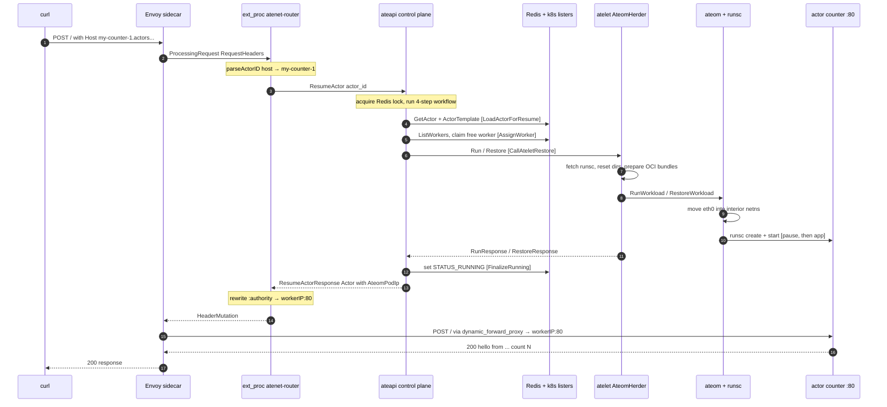

# Life of a Request

This document traces, at the function- and RPC-level, exactly what happens when a
request arrives for an actor that is currently **suspended** (a "cold start").
It is meant as a learning reference, so it names concrete components and methods
and links them to `file:line` in the source.

The scenario is the one from the README / counter demo:

```bash
# Bind a local port to the network router's HTTP service.
kubectl port-forward -n ate-system svc/atenet-router 8000:80

# Send a request to actor "my-counter-1".
curl -X POST -H "Host: my-counter-1.actors.resources.substrate.ate.dev" http://localhost:8000
```

In one paragraph: Envoy receives the request, hands the headers to the
`atenet-router` external-processing (ext_proc) server, which extracts the actor
id from the `Host` header and asks the control plane (`ateapi`) to **resume** the
actor. The control plane assigns a warm worker, tells that worker's node agent
(`atelet`) to boot or restore the actor's sandbox (via the in-pod `ateom`/gVisor
driver), and returns the worker's IP. ext_proc rewrites the request's
`:authority` to that worker IP, and Envoy's dynamic-forward-proxy forwards the
original request to the now-running actor. The response flows straight back.

> This is the **cold-start** path. The warm path and the suspend path are
> summarized at the end under [Variations](#variations).

---

## Cast of components

| Component | What it is | Speaks |
| --- | --- | --- |
| **envoy** | Data-plane proxy. Sidecar container co-located with `atenet-router`. Listens on `:8080` (http) / `:8443` (https). | HTTP in; gRPC ext_proc + ADS/xDS out |
| **atenet-router** | Network control: the xDS server that configures Envoy *and* the ext_proc server that makes per-request routing decisions. Same pod as the envoy sidecar. | gRPC ext_proc `:50051`, xDS `:18000` |
| **ateapi** | The control plane ("brain"). Owns actor/worker state (in Redis/ValKey) and reads `ActorTemplate` / `WorkerPool` from Kubernetes. Runs the resume/suspend workflows. | gRPC (`ateapipb.Control`) |
| **atelet** | Per-node supervisor (DaemonSet). The "herder" (`AteomHerder`) that prepares OCI bundles, fetches `runsc`, moves snapshots to/from GCS, and drives the in-pod `ateom`. | gRPC (`ateletpb.AteomHerder`) |
| **ateom** | The "interior gVisor" driver running *inside* each worker pod. Invokes `runsc` to create/start/checkpoint/restore the sandbox. | gRPC (`ateompb`) |
| **actor** | The user workload (here `demos/counter`), an HTTP server listening on `:80` inside the gVisor sandbox. | HTTP |

Deployment shape (`manifests/ate-install/atenet-router.yaml`): one pod runs **two
containers** — the `atenet-router` Go process and the `envoy` sidecar. Envoy's
bootstrap ConfigMap points its ADS `xds_cluster` at `127.0.0.1:18000`, i.e. the
co-located router process. The `atenet-router` Service maps `80 → 8080` (envoy
http) and `443 → 8443`, so `port-forward …/atenet-router 8000:80` lands on
Envoy's `:8080` listener.

---

## Sequence diagram


Link: https://cn-diagnostics.teams.x20web.corp.google.com/mermaid/index.html#data=gzip:H4sIAAAAAAAAE3VU227aQBD9lRGvAUqrPkR+sIRyRU0JAqI+kApt7AFWrHec2TGEVn3tB/QT+yXV7ppbIS/2ejxnzlzO7M9GRjk2kobD1wpthtdazVkVzxYAQFVCtipekON3qVh0pktlBbKKzan1xq5oA8rVB6dzzNQZ9M2bDJgy74lvMi3DWdCitJgqOUfYHfS8uxJUpYaMrDAZKI2yeOo8EmL07kPMtYMLWF46MNoJsjsTWtCg1NH9qStIxT1yfjYR/7N2pgIugCvrslO/b8RLQyoPrpkQQ0aVFWRILjvPNgJ8G1tpGtqVwOBxNIYPsNaygHtyAsWmVYNaH9shiGu32xEaMB4be5mAf6Jz2s6HfppOoH7fo8p3hfdJEGiFDDtgqdhh10fvXcPC8/79/eeIu2aMgFaadge9BIboqiLiYoFTnf/PERxV9lppxnoYhrJl0zcNPrecYAlr4uXM0Dpiu4NeK03DABO4Q4nxLyC8x1iURgnC5IFUHky3xDGR72fwD9qJnwOya0JmlC5gxoiBEhkmXef03EaPI3yURALDysIHX2kQ1ORKGRN/1aYtKNgOcDOUbBGV0QRGhwK59kmUjKVihMerHrxUNjfoTkNQEZh3CtplsLXsIFTsEQWtEFAWHdBWyD+QNTFYFOuOEds4SUwRMkbf1QtwolhgUqrKYRNkgRZUWR5XuZt/ZYfoSrIO9xluLWeG4ZswGnfHT6Pp8Knf7/XvYHKrrTL6Bw4ra7WdH8zgUNkHStsxRl2EVQlVDSjvle9KnHHNWhASVcmCWMsmaDzqoDcIG3ko8f1OxuX5WokSTfZ49fZtrDd3pRXkG6sKnU1nxGvFub/c3t5h2+IP6D51OrBAYwhmTAW02+14bUD/kLqVpv7miO5ct6TRbHxpJDNlHDYbRbzXVxrXjV//ADVHSMXnBQAA 
---

## Step-by-step trace

### 1. curl → Envoy listener

The port-forward sends the request to Service `atenet-router:80`, which targets
the envoy sidecar's `:8080`. Envoy's `ingress_http_listener` is built by the xDS
server (`buildListener`, `cmd/atenet/internal/app/router/xds.go:380`; the port
comes from the `--port-http=8080` flag). Its HTTP Connection Manager
(`buildHcm`, `xds.go:334`) chains three HTTP filters **in order**:

1. `envoy.filters.http.ext_proc`
2. `envoy.filters.http.dynamic_forward_proxy`
3. `envoy.filters.http.router`

The route table (`buildRoutes`, `xds.go:270`) matches every path prefix `/` and
routes it to the `dynamic_forward_proxy_cluster`. So before any forwarding can
happen, the request must pass through ext_proc.

### 2. Envoy → ext_proc (request headers)

The ext_proc `ProcessingMode` (`xds.go:314`) is configured with
`RequestHeaderMode: SEND` and `ResponseHeaderMode: SKIP` — meaning Envoy consults
the external processor on the way **in** but not on the way **out**. Envoy
streams the request headers over gRPC to cluster `ate-cluster`
(`127.0.0.1:50051`, the co-located router process).

The server is `ExtProcServer.Process`
(`cmd/atenet/internal/app/router/extproc.go:75`), a bidirectional stream. For a
`ProcessingRequest_RequestHeaders` message it calls `handleRequestHeaders`
(`extproc.go:125`).

### 3. Host parsing → actor id

`newRequestMetadata` (`extproc_in.go:36`) collects headers and pulls out
`:authority`/`host` and `:path`. `parseActorID` (`extproc_in.go:64`) strips the
trailing `.actors.resources.substrate.ate.dev` suffix
(`resources.ActorDNSSuffix`) and validates the remainder, yielding
`actorID = "my-counter-1"`. An invalid host short-circuits with a `404` produced
by `immediateResponse` (`extproc_out.go:47`).

### 4. ext_proc → control plane `ResumeActor`

`handleRequestHeaders` calls `s.resumer.ResumeActor(ctx, actorID)`.
`ActorResumer.ResumeActor` (`resumer.go:42`) does two important things:

- **Deduplication:** it wraps the resume in a `singleflight.Group` keyed by actor
  id, so N concurrent requests for the same actor trigger only **one** resume.
  The underlying call uses a detached background context (15s) so that if the
  first caller disconnects, the resume still completes for the others.
- **Retry:** it retries on gRPC `codes.Aborted` (lock contention) with
  exponential backoff; other errors (`NotFound`, `FailedPrecondition`, …) are
  returned unchanged so the HTTP boundary can map them faithfully.

It calls `apiClient.ResumeActor` (`ateapipb.ControlClient`) over gRPC to `ateapi`.

### 5. Control plane: the resume workflow

`Service.ResumeActor` (`cmd/ateapi/internal/controlapi/resume_actor.go:27`)
validates the request and delegates to `ActorWorkflow.ResumeActor`
(`workflow.go:131`). That method:

1. Acquires a per-actor Redis lock (`acquireActorLock`, `workflow.go:189`; lock
   TTL 30s, with a child context that expires *before* the lock so the lock is
   never held past a hung step). Concurrent resumes for the same actor get
   `codes.Aborted` here → which is exactly what step 4 retries on.
2. Runs four idempotent steps through the generic `RunWorkflow` engine
   (`workflow.go:56`). Each step implements `Name / IsComplete / Execute /
   RetryBackoff`; `IsComplete` lets a step be skipped if its effect is already
   present (this is what makes retries safe — "client-driven forward recovery").

The steps (`workflow_resume.go`):

- **LoadActorForResumeStep** (`:47`) — `store.GetActor` from Redis and fetch the
  `ActorTemplate` from the Kubernetes lister. Populates the workflow state.
- **AssignWorkerStep** (`:78`) — `ListWorkers`, reuse an already-assigned worker
  if a prior attempt left one, else `findFreeWorker` (`:143`) picks a random free
  worker **in the template's `WorkerPoolRef`**. It marks the worker as owning the
  actor, sets the actor to `STATUS_RESUMING`, and stamps
  `AteomPodIp/AteomPodName/AteomPodUid` onto the actor record, persisting both
  with optimistic version checks. (`IsComplete` returns true if the actor is
  already `STATUS_RUNNING`.)
- **CallAteletRestoreStep** (`:160`) — dials the assigned worker's `atelet`
  (`dialer.DialForWorker`), builds a `WorkloadSpec` and `RunscConfig` from the
  template, then branches:
  - actor has a `LastSnapshot` → `client.Restore` from it;
  - else the template has a `GoldenSnapshot` and this isn't a forced fresh
    `Boot` → `client.Restore` from the golden snapshot;
  - else → `client.Run` (fresh boot from the template spec).

  **For the very first request to a never-run actor:** with a golden snapshot it
  takes the `Restore` branch; with none it takes `Run`.
- **FinalizeRunningStep** (`:271`) — re-reads the actor and sets it to
  `STATUS_RUNNING`.

`ResumeActor` returns the `Actor`, now carrying `AteomPodIp`.

### 6. Control plane → atelet (`AteomHerder.Run` / `.Restore`)

`atelet` exposes `AteomHerder` (`cmd/atelet/main.go:182`), which implements
`ateletpb.AteomHerderServer`. The control plane's `CallAteletRestoreStep` calls
one of:

- **`AteomHerder.Run`** (`main.go:278`) — fresh boot. It:
  1. `fetchRunscAndPrep` (`main.go:479`) — ensures the pinned `runsc` binary is on
     disk, downloading it from GCS and verifying its SHA-256 if absent.
  2. `resetActorDirs` — clears the actor's working directories.
  3. `prepareOCIBundles` (`main.go:492`) — pulls images and assembles OCI bundles
     for the `pause` container and every application container, in parallel.
  4. `dialAteom` — opens a gRPC connection into the worker pod's `ateom`.
  5. calls `client.RunWorkload` — telling `ateom` to `runsc create` + `runsc
     start` the pause container and all app containers.

  Returns an empty `RunResponse` on success.

- **`AteomHerder.Restore`** (`main.go:414`) — snapshot path. Same prep, but it
  first downloads `checkpoint.img`, `pages.img`, and `pages_meta.img` (zstd) from
  GCS into the restore dir (in parallel), then calls `client.RestoreWorkload`.

(The counterpart `AteomHerder.Checkpoint`, `main.go:351`, is used by suspend.)

### 7. atelet → ateom → gVisor (`runsc`)

Inside the worker pod, `AteomService.RunWorkload`
(`cmd/ateom-gvisor/main.go:210`):

1. Moves the pod's `eth0` into the **interior** network namespace and brings up
   `lo`/`eth0`, restoring routes/addresses (so the sandboxed actor inherits the
   pod's networking).
2. Drives gVisor through the `runsc` wrapper (`cmd/ateom-gvisor/runsc.go`):
   - `cmdCreate` + `cmdStart` for the `pause` container (`main.go:280`),
   - then `cmdCreate` + `cmdStart` for each application container (`main.go:294`).

`RestoreWorkload` (`main.go:384`) instead runs `runsc create` then `runsc restore
-image-path …` for the pause and app containers (note the
`-allow-connected-on-save` flag in `cmdStart`/`cmdRestore`, a workaround for a
networking-resumption bug in `runsc`).

After this, the actor process is live inside gVisor. For the counter demo
(`demos/counter/counter.go`) that's an HTTP server listening on `:80`
(`counter.go:54`), which also writes a 1 MiB random file to exercise filesystem
checkpoint/restore.

### 8. Routing decision returns up the stack

Back in `handleRequestHeaders` (`extproc.go:139`), the `ResumeActor` call has
returned the `Actor`. ext_proc reads `actor.GetAteomPodIp()` (`extproc.go:155`),
validates it parses as an IP, and forms `targetAddr = net.JoinHostPort(workerIP,
"80")` (`extproc.go:162` — there's a `TODO` to support ports other than 80).

It then builds a `HeaderMutation` that **rewrites the `:authority` header** to
`workerIP:80` via `addAuthorityMutation` (`extproc_out.go:36`) and returns it to
Envoy as the ext_proc response.

### 9. Envoy forwards the original request

Now that ext_proc has mutated `:authority`, control returns to Envoy's filter
chain. The `dynamic_forward_proxy` filter + cluster
(`buildDynamicForwardProxyCluster`, `xds.go:249`; the route's `Cluster` is
`"dynamic_forward_proxy_cluster"`, `xds.go:287`) resolves the rewritten authority
and proxies the **original buffered `POST /`** to `workerIP:80`.

The counter's handler (`counter.go:44`) increments an in-memory counter and
returns `hello from: <pod-ip> | preserved memory count: N`. Because state is
preserved across suspend/resume, that counter keeps climbing on subsequent
requests even though the sandbox may have moved.

### 10. Response back to curl

The response travels actor → Envoy → port-forward → curl. Since
`ResponseHeaderMode` is `SKIP` (step 2), ext_proc is **not** consulted on the
response path; Envoy streams it straight back.

---

## Variations

- **Warm path (actor already `STATUS_RUNNING`).** Steps 1–4 are identical. In the
  workflow, `AssignWorkerStep.IsComplete` and `CallAteletRestoreStep.IsComplete`
  both return true (`workflow_resume.go:84`, `:165`), so those steps are skipped
  entirely — no worker assignment, no `atelet` call. The control plane just
  returns the existing `Actor{AteomPodIp}` and routing happens immediately. This
  is the fast path the architecture targets (~100ms activation is only paid on
  cold start).

- **Suspend.** Triggered by an explicit `SuspendActor` call (not by inbound
  traffic). `ActorWorkflow.SuspendActor` (`workflow.go:161`) runs its own 4-step
  workflow: mark suspending → `CallAteletSuspendStep` → finalize. `atelet`'s
  `Checkpoint` (`cmd/atelet/main.go:351`) tells `ateom` to `CheckpointWorkload`
  (freeze + capture memory/disk via `runsc checkpoint`), then streams the
  resulting `checkpoint.img` / `pages.img` / `pages_meta.img` to GCS (zstd) and
  resets the actor dirs so the worker can be reclaimed. The actor returns to
  `STATUS_SUSPENDED`, now pointing at `LastSnapshot` for the next resume.

---

## Appendix: key files

| Concern | File |
| --- | --- |
| Envoy listener / filters / route / clusters (xDS) | `cmd/atenet/internal/app/router/xds.go` |
| ext_proc stream + routing decision | `cmd/atenet/internal/app/router/extproc.go` |
| Host → actor id parsing | `cmd/atenet/internal/app/router/extproc_in.go` |
| `:authority` rewrite / error responses | `cmd/atenet/internal/app/router/extproc_out.go` |
| Dedup + retry of resume | `cmd/atenet/internal/app/router/resumer.go` |
| `ResumeActor` RPC | `cmd/ateapi/internal/controlapi/resume_actor.go` |
| Workflow engine + lock | `cmd/ateapi/internal/controlapi/workflow.go` |
| Resume workflow steps | `cmd/ateapi/internal/controlapi/workflow_resume.go` |
| atelet `AteomHerder` (Run/Restore/Checkpoint) | `cmd/atelet/main.go` |
| ateom gVisor driver (RunWorkload/RestoreWorkload) | `cmd/ateom-gvisor/main.go` |
| `runsc` command wrapper | `cmd/ateom-gvisor/runsc.go` |
| Example actor | `demos/counter/counter.go` |
| Deployment (router + envoy sidecar, ports) | `manifests/ate-install/atenet-router.yaml` |
| High-level architecture | `docs/architecture.md` |
